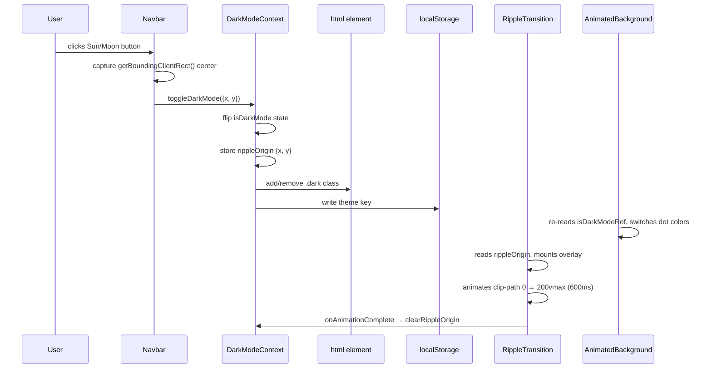

# feat: Add dark/light mode ripple toggle with themed typography

## Summary

Implement an interactive dark/light mode toggle in the portfolio navbar with a circular ripple animation that expands from the toggle button on activation. The plan also defines a softer light-mode CSS variable palette, enforces a bold typography rule for subheadings and italics responsive to both themes, adapts the animated dot background to the active theme, and fixes the existing stub infrastructure so theme preference persists across page loads.

---

## Problem Frame

The portfolio is currently hard-coded dark-only: `client/index.html` forces `.dark` on `<html>` via an inline script, `DarkModeContext` always returns `isDarkMode: true` with no toggle function, and `DarkModeToggle.tsx` returns `null`. A light-mode CSS variable palette does not exist. The ripple animation and navbar toggle button do not exist. Adding the toggle requires wiring real state into the context, defining the light palette, building the ripple overlay, threading the button into the navbar, and adapting the `AnimatedBackground` canvas.

---

## Requirements

**Toggle and persistence**
- R1. The navbar displays a Sun/Moon icon button at the rightmost position in both desktop and mobile pill variants.
- R2. Clicking the toggle flips between dark and light modes, persisting the choice to `localStorage` under the key `theme`.
- R3. On page load, the stored preference is read before React hydrates to prevent flash of wrong theme.
- R4. If no stored preference exists, dark mode is the default.

**Ripple animation**
- R5. Toggling triggers a circular ripple overlay that expands from the exact center of the toggle button outward to cover the full viewport.
- R6. The overlay is colored with the incoming theme's background, making the new theme appear to "bloom" from the button.
- R7. The animation duration is approximately 600ms; the overlay is removed once the animation completes.

**Light mode palette**
- R8. A soft light palette is defined using `oklch` values consistent with the existing dark theme token structure (off-white background, near-black foreground, appropriate muted and border values).
- R9. All existing Tailwind `dark:` utility classes switch correctly once `.dark` is removed from `<html>`.

**Typography**
- R10. `h2`–`h6` elements and `em`/`i` elements render with `font-weight: 800` globally.
- R11. These elements resolve to near-black in light mode and near-white in dark mode via the semantic `--foreground` CSS variable, making them visually distinct from body text in both themes.

**AnimatedBackground**
- R12. Dot colors in `AnimatedBackground` adapt based on the active theme: warm-light dots on dark backgrounds; near-charcoal dots on light backgrounds, preserving the mouse-proximity glow behavior in both modes.

---

## Key Technical Decisions

- **Ripple implementation: Framer Motion `motion.div` with CSS `clip-path: circle()`**. Framer Motion is already installed and used in `HonorsPortfolio.tsx`. A fixed-position overlay animated from `clip-path: circle(0px at X Y)` to `clip-path: circle(200vmax at X Y)` via `motion.div`'s `animate` prop is idiomatic for the existing stack. The View Transitions API (~89% browser support) was considered but requires an imperative `document.startViewTransition()` call that integrates awkwardly with React state; CSS-only transitions can't accept a runtime button origin point.

- **Toggle origin flows through DarkModeContext**. The toggle button captures its center coordinates via `getBoundingClientRect()` on click. These coordinates and the toggle dispatch travel together through `toggleDarkMode(origin)` in `DarkModeContext`, which stores them as `rippleOrigin`. `RippleTransition` reads `rippleOrigin` from context and self-drives the animation, calling `clearRippleOrigin` on completion. This avoids prop-drilling, portals from `Navbar`, or a separate event bus.

- **RippleTransition renders at app root in `App.tsx`**. The overlay must cover the full viewport above all content. Rendering at the root (inside `DarkModeProvider`, outside the scroll container) is the cleanest position — no portal needed and lifecycle management stays adjacent to the provider.

- **Light palette via `:root:not(.dark)` selector**. The existing dark palette stays in `:root` unchanged. Light-mode overrides live in a `:root:not(.dark)` block below it — the standard pattern for Tailwind v4's `@custom-variant dark (&:where(.dark, .dark *))` setup already in `index.css`.

- **Navbar pill border switched to semantic `border-border` token**. The current `border-white/20` is invisible on a light background. The `--border` CSS variable is defined per-theme in both palette blocks, so `border-border` (already mapped via `@theme inline`) makes the border theme-aware without hardcoding a second color.

- **Typography rule in `@layer base`**. Setting `font-weight: 800` and `color: var(--foreground)` on `h2–h6, em, i` in `@layer base` is the correct layer for baseline typography. Tailwind utility classes (`font-bold`, `font-medium`) applied explicitly to individual elements live in `@layer utilities` and will still win per-element, which is intentional — the base rule is the theme-responsive default, not a lock.

---

## High-Level Technical Design



---

## Implementation Units

### U1. Upgrade DarkModeContext with real toggle and persistence

**Goal:** Replace the always-dark stub with a stateful provider that toggles `.dark` on `<html>`, persists to `localStorage`, initializes from stored preference, and exposes `toggleDarkMode(origin)`, `rippleOrigin`, and `clearRippleOrigin` for consumers.

**Requirements:** R2, R3, R4

**Dependencies:** none

**Files:**
- `client/src/context/DarkModeContext.tsx`

**Approach:**
- Expand `DarkModeContextType` with `toggleDarkMode: (origin: {x: number; y: number}) => void`, `rippleOrigin: {x: number; y: number} | null`, and `clearRippleOrigin: () => void`.
- Initialize `isDarkMode` via `useState` from `localStorage.getItem('theme') !== 'light'` (dark is the default when nothing is stored).
- A `useEffect` on `isDarkMode` applies `classList.add/remove('dark')`, updates `style.colorScheme`, and writes `localStorage.setItem('theme', isDarkMode ? 'dark' : 'light')`.
- `toggleDarkMode(origin)` calls `setIsDarkMode(prev => !prev)` and `setRippleOrigin(origin)` in the same handler.
- `clearRippleOrigin` sets `rippleOrigin` back to `null`.

**Patterns to follow:** Existing `DarkModeContext.tsx` provider structure; `useState`/`useEffect` patterns in `client/src/hooks/`.

**Test scenarios:**
- Calling `toggleDarkMode({x: 100, y: 200})` from dark flips `isDarkMode` to `false`, removes `.dark` from `document.documentElement.classList`, writes `theme: 'light'` to `localStorage`, and stores `rippleOrigin: {x: 100, y: 200}`.
- Calling `toggleDarkMode` from light restores `isDarkMode: true`, adds `.dark`, writes `theme: 'dark'`.
- On mount with `localStorage.theme === 'light'`, `isDarkMode` initializes as `false` and `.dark` is absent from `<html>`.
- On mount with no `localStorage` entry, `isDarkMode` initializes as `true` and `.dark` is present.
- `clearRippleOrigin()` sets `rippleOrigin` to `null` without changing `isDarkMode`.
- `useDarkMode()` outside a `DarkModeProvider` throws the existing error.

**Verification:** After wiring, call `toggleDarkMode` in the browser console via a ref or DevTools; confirm `<html>` class toggles and `localStorage.theme` updates on each call.

---

### U2. Anti-FOUT inline script, light mode CSS palette, and typography rules

**Goal:** Eliminate flash of wrong theme on page load, define the light-mode CSS variable palette, enforce the bold subheading/italic typography rule globally, and make the navbar pill border theme-aware.

**Requirements:** R3, R4, R8, R9, R10, R11

**Dependencies:** none (CSS and HTML changes are independent of U1)

**Files:**
- `client/index.html`
- `client/src/index.css`

**Approach:**

*`index.html` anti-FOUT script* — Remove the hardcoded `class="dark"` attribute from `<html>` and replace the always-dark inline script with one that reads `localStorage.getItem('theme')`: if `'light'`, remove `.dark` and set `colorScheme` to `'light'`; otherwise add `.dark` and set `colorScheme` to `'dark'`. Remove the `<meta name="color-scheme">` tag (the script sets it directly, avoiding a mismatch when `<meta>` and script disagree).

*`index.css` light palette* — Add a `:root:not(.dark)` block after the existing `:root` dark palette. Representative values (exact `oklch` can be tuned during implementation):
- `color-scheme: light`
- `--background: oklch(0.97 0 0)` — off-white
- `--foreground: oklch(0.13 0 0)` — near-black
- `--card: oklch(0.99 0 0)`, `--card-foreground: oklch(0.13 0 0)`
- `--primary: oklch(0.20 0 0)`, `--primary-foreground: oklch(0.97 0 0)`
- `--secondary: oklch(0.92 0 0)`, `--secondary-foreground: oklch(0.20 0 0)`
- `--muted: oklch(0.93 0 0)`, `--muted-foreground: oklch(0.48 0 0)`
- `--accent: oklch(0.93 0 0)`, `--accent-foreground: oklch(0.20 0 0)`
- `--border: oklch(0 0 0 / 12%)`, `--input: oklch(0 0 0 / 8%)`, `--ring: oklch(0.40 0 0)`
- Sidebar tokens using the same light-mode values

Update `@layer base html { color-scheme: dark; }` to conditionally set `color-scheme` based on whether `.dark` is present. The simplest approach: remove the hardcoded `color-scheme: dark` from `@layer base html` and rely on the `:root` / `:root:not(.dark)` `color-scheme` declarations instead.

*Typography rule* — Add to `@layer base`:
```
h2, h3, h4, h5, h6, em, i {
  font-weight: 800;
  color: var(--foreground);
}
```

`--foreground` resolves to `oklch(0.985 0 0)` (near-white) in dark mode and `oklch(0.13 0 0)` (near-black) in light mode automatically.

*Navbar border* — The `border-white/20` class in `Navbar.tsx` is the only component class that needs to change to `border-border` for theme awareness. This decision is documented here for context; the actual code change belongs to U4, which modifies `Navbar.tsx`.

**Test scenarios:**
- With `localStorage.theme = 'light'`, a hard reload shows a light background before React hydrates — no dark flash.
- With no `localStorage` entry, a hard reload shows dark mode.
- In light mode, `body` background is off-white and `text-foreground` resolves to near-black.
- In dark mode, all token values are identical to the current behavior.
- An `<h3>` element renders at `font-weight: 800` and uses the foreground color in both modes.
- An `<em>` element renders at `font-weight: 800` and uses the foreground color in both modes.

**Verification:** Toggle to light and reload — no flash. DevTools computed styles on `<h2>` show `font-weight: 800` and a near-black color in light mode. DevTools computed styles on `<em>` in a blog post show `font-weight: 800`.

---

### U3. Implement RippleTransition overlay component

**Goal:** A full-screen fixed overlay component that reads `rippleOrigin` and `isDarkMode` from context, plays a `clip-path: circle()` expanding animation in the incoming theme's background color, and clears the origin on completion.

**Requirements:** R5, R6, R7

**Dependencies:** U1 (context must expose `rippleOrigin`, `isDarkMode`, `clearRippleOrigin`)

**Files:**
- `client/src/components/RippleTransition.tsx` (new file)

**Approach:**
- Import `useDarkMode` to read `isDarkMode`, `rippleOrigin`, and `clearRippleOrigin`.
- When `rippleOrigin` is non-null, render a `motion.div` with:
  - `position: fixed`, `inset: 0`, `z-index: 9999`, `pointer-events: none`
  - Background class toggled on `isDarkMode` to match the incoming theme's `--background` value. Use `bg-background` (semantic Tailwind token) — since the context has already flipped `isDarkMode` and updated `<html class>`, `bg-background` will resolve to the new theme's background color at render time.
  - `initial={{ clipPath: 'circle(0px at Xpx Ypx)' }}` and `animate={{ clipPath: 'circle(200vmax at Xpx Ypx)' }}` where `X`, `Y` come from `rippleOrigin`.
  - `transition={{ duration: 0.6, ease: 'easeOut' }}`
  - `onAnimationComplete` calls `clearRippleOrigin()`.
- Key the `motion.div` on `${rippleOrigin.x}-${rippleOrigin.y}` so rapid toggles get a fresh animation rather than resuming a prior one.

**Patterns to follow:** Framer Motion `motion.div` and `AnimatePresence` usage in `client/src/components/HonorsPortfolio.tsx`.

**Test scenarios:**
- When `rippleOrigin` is `null`, the component renders nothing (no DOM node added).
- When `rippleOrigin` is set, a `motion.div` is present in the DOM with `position: fixed` and `z-index: 9999`.
- After ~600ms, `clearRippleOrigin` has been called and the `motion.div` is removed.
- Toggling twice in rapid succession: the first animation's `onAnimationComplete` does not interfere with the second animation (key change resets Framer state).
- The overlay background matches the incoming theme: dark overlay when going dark→light is wrong; light overlay when going dark→light is correct.

**Verification:** Open DevTools Elements panel during a toggle — observe the `motion.div` mount, the `clip-path` style animating from `circle(0px ...)` to `circle(200vmax ...)`, and the node unmounting after animation.

---

### U4. Wire toggle button into Navbar and replace DarkModeToggle stub

**Goal:** Replace the `DarkModeToggle` stub with a real Sun/Moon button, insert it at the right end of both navbar pills, wire it to `toggleDarkMode` with the button's center coordinates, and fix the navbar pill border color.

**Requirements:** R1

**Dependencies:** U1, U2 (palette needed for visible button/border), U3 (ripple must exist before wiring toggle)

**Files:**
- `client/src/components/DarkModeToggle.tsx`
- `client/src/components/Navbar.tsx`
- `client/src/App.tsx`

**Approach:**

*`DarkModeToggle.tsx`* — Replace the stub with a real component:
- Import `useDarkMode`, `Button` (shadcn), and `Sun`/`Moon` from `lucide-react`.
- Render `<Button variant="ghost" size="icon" className="rounded-full h-10 w-10 p-0">` containing `isDarkMode ? <Moon className="w-[18px] h-[18px]" /> : <Sun className="w-[18px] h-[18px]" />`.
- `onClick` handler: call `e.currentTarget.getBoundingClientRect()`, compute center as `{x: rect.left + rect.width / 2, y: rect.top + rect.height / 2}`, then call `toggleDarkMode({x, y})`.
- Add `aria-label={isDarkMode ? 'Switch to light mode' : 'Switch to dark mode'}`.

*`Navbar.tsx`* — Two changes:
1. Import `DarkModeToggle` and append `<DarkModeToggle />` after the `navItems.map()` in both the desktop `<div>` and the mobile `<div>`. No separator or divider needed — existing `gap-2`/`gap-1` spacing handles it.
2. Replace `border-white/20` on both pill containers with `border-border` (the semantic Tailwind token that maps to `--border`).

*`App.tsx`* — Import `RippleTransition` and render it as a sibling of the router outlet inside `DarkModeProvider` but outside any scrolling container. It must render above the `Navbar` in z-order (z-9999 handles this regardless of DOM order).

**Patterns to follow:** Existing `<Button>` usage in `Navbar.tsx`; Lucide `Home`/`Briefcase` icon size pattern (`"w-[18px] h-[18px]"` for mobile).

**Test scenarios:**
- Both desktop and mobile pills show the toggle button at the rightmost position.
- Desktop pill renders a `w-10 h-10` icon button; mobile pill renders the same size to match existing icon buttons.
- Clicking the button passes coordinates to `toggleDarkMode`; `rippleOrigin` in context becomes non-null.
- The icon is `Moon` when `isDarkMode: true` and `Sun` when `isDarkMode: false`.
- `activeSection` and `scrollToSection` behavior is unaffected by the toggle button.
- The navbar pill border is visible in light mode (no longer transparent).
- `RippleTransition` in `App.tsx` renders and covers the full viewport during a toggle.

**Verification:** Visual check in browser — toggle button at the right end of the nav in both breakpoints. Border visible on light background. Ripple animation fires from button center.

---

### U5. Adapt AnimatedBackground dot colors to active theme

**Goal:** Thread `isDarkMode` into the canvas animation loop and switch dot fill colors between the existing warm-light values (dark mode) and near-charcoal values (light mode), preserving the mouse-proximity glow behavior in both modes.

**Requirements:** R12

**Dependencies:** U1 (context must expose real `isDarkMode`)

**Files:**
- `client/src/components/AnimatedBackground.tsx`

**Approach:**
- Import `useDarkMode` and call `const { isDarkMode } = useDarkMode()` at component top.
- Add `const isDarkModeRef = useRef(isDarkMode)` and a `useEffect(() => { isDarkModeRef.current = isDarkMode; }, [isDarkMode])` to pass the current value into the rAF loop without restarting it — matching the existing `mouseRef` pattern.
- Inside the `animate` loop's per-dot color block (currently lines 131–133 in `AnimatedBackground.tsx`), branch on `isDarkModeRef.current`:
  - **Dark mode** (existing behavior): warm-white base with warm color shift toward mouse — `r ≈ 180 + proximity*75`, `g ≈ 180 + proximity*40`, `b ≈ 200 + proximity*55`.
  - **Light mode**: near-charcoal base with a cool dark-blue proximity shift — `r ≈ 40 + proximity*20`, `g ≈ 40 + proximity*15`, `b ≈ 60 + proximity*30`. These values produce dark dots visible on the off-white `#f7f7f7`-equivalent background while the glow effect still reads.

**Patterns to follow:** The `mouseRef`/`useRef` pattern already in `AnimatedBackground.tsx` for passing live state into the rAF loop without effect re-runs.

**Test scenarios:**
- In dark mode, canvas dot `fillStyle` values have `r`, `g`, `b` in the ~180–255 range.
- In light mode, canvas dot `fillStyle` values have `r`, `g`, `b` in the ~40–90 range.
- Mouse proximity glow increases dot brightness in both modes (higher values relative to base).
- Toggling theme mid-hover transitions dot colors on the next animation frame — no rAF restart, no console errors.
- Dots are visible and the grid is readable in light mode against the off-white background.

**Verification:** Toggle to light mode — the dot grid visibly shifts to dark dots. Move mouse over canvas — proximity glow still works. Toggle back to dark — dots return to warm-white.

---

## Scope Boundaries

**Deferred to follow-up work:**
- Components using hardcoded `rgba` or `hex` color values outside the CSS variable system (gradient stops, inline `style` color props) — these require per-component audits.
- System preference (`prefers-color-scheme`) as a first-visit default: this plan defaults to dark when no `localStorage` entry exists; matching the system preference on first visit is an enhancement.
- Blog page hero text and other page-specific typography that uses explicit `text-gray-900 dark:text-white` classes — those switch automatically via `dark:` Tailwind utilities but were not part of the user's ask.

---

## Sources & Research

- `client/src/context/DarkModeContext.tsx` — existing stub; interface and provider shape to extend.
- `client/src/components/Navbar.tsx` — pill container structure; `navItems.map()` call sites to append the toggle button after; `border-white/20` to swap.
- `client/src/components/AnimatedBackground.tsx:131–133` — current `rgba(r, g, b, opacity)` fill values and the `mouseRef` pattern to mirror for `isDarkModeRef`.
- `client/src/index.css` `:root` block — existing dark palette `oklch` token names and values; light palette must use the same token names.
- `client/src/components/HonorsPortfolio.tsx` — Framer Motion `motion.div`, `AnimatePresence`, and variant object patterns to follow in `RippleTransition`.
- `client/index.html` — current always-dark inline script to replace with localStorage-aware version.
